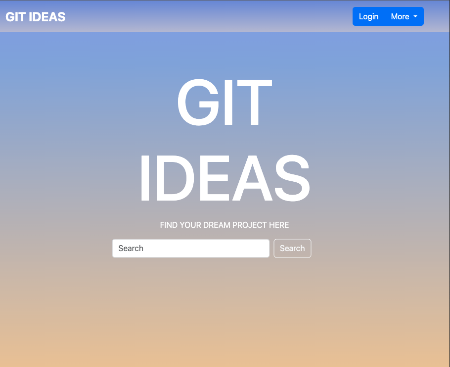
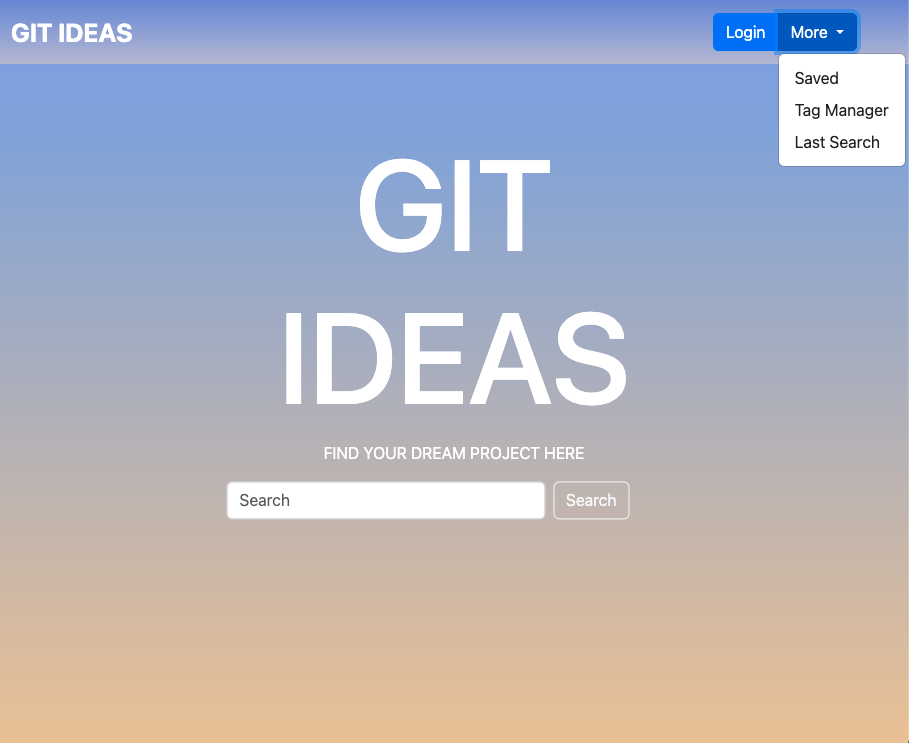
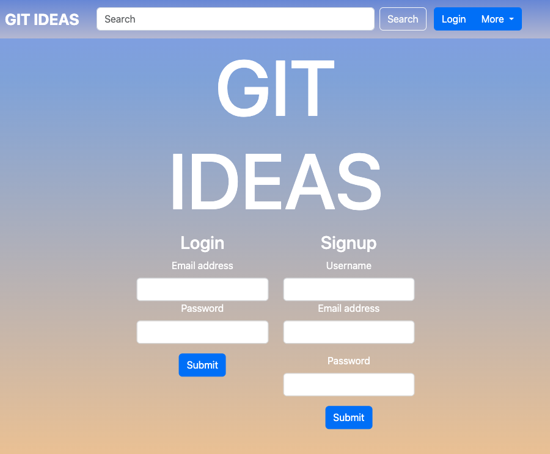
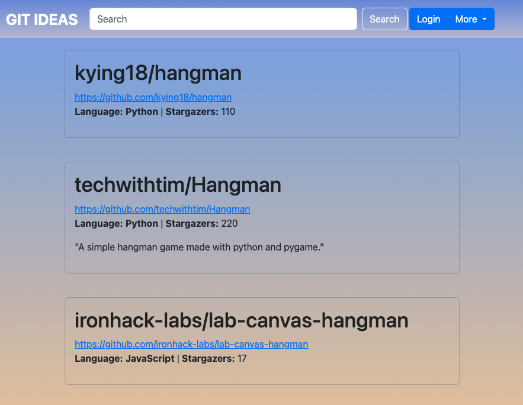

# Git Ideas 

WhichWord is Wordle clone made with pure Javascript, HTML, and CSS. When you visit the WhichWord website, you are introduced to a game title with a Easy, Medium or Hard selection. Easy being a 5 letter word, Medium being a 6 letter word and Hard being a 7 letter word. Each box can hold one letter, and so you guess at the answer by typing in letters word and pressing 'Enter'. There aren't any clues up front, so any letter will do as an initial guess.

    

## Table of Contents

- [Installation](#installation)
- [Usage](#usage)
- [Credits](#credits)
- [License](#license)

 

## Getting Started

These instructions will get you a copy of the project up and running on your local machine for development and testing purposes.

1. Within GitHub, navigate to the main page of the repository.

2. Click the Clone or download button.

3. Copy the clone URL for the repository.

4. Open Terminal or CMD Prompt(Windows).

5. Change your current working directory to the location where you'd like the cloned directory be stored.

6. Type git clone, and then paste the URL you copied in Step 3.

7. git clone https://github.com/SeanAllen19/GIT-IDEAS.git

8. Press Enter and a new local cloned repository will be created.   
    
       

## Screenshots

### Home Page

### Navigation Bar

### Login and Sign Up Page

### Results Page

### Save and Edit Page

### Saved Results Page

       
    
## Built Using

GitHub - https://github.com/

GitHub Rest API - 

Axios - 

Handlebars - 

Bootstrap -

Mysql - 

Sequelize - 

Jawsdb - 

     

## Authors
     
  Rebecca Girndt - [GitHub]()
  
  Michael Smith - [GitHub]()
  
  Brett Nachman - [GitHub]()
  
  Sean Allen - [GitHub]()
  
      

## Development

We were assigned together to work on a project and with most ideas we brainstormed and shared ideas.

      

## Saved for Later

Allow for a letter choice to only highlight a single instance of that letter if it appears in the word

Add an API that delivers quotes based on the correct word

Call on additional features in the dictionary API (e.g., thesaurus and etymology)

Call on additional freatures in the song API (e.g., a link to hear the song play, view album or artist artwork)

      

## Acknowledgements

Thank you to all of our friends, online and IRL, for the help and motivation!!

Canva - https://www.canva.com/

