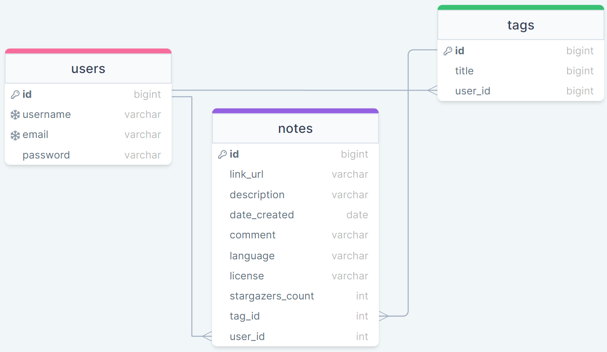

# Git Ideas 

## Description

Git Ideas is an app that allows the user to search GitHub for project inspiration. Users can search GitHub repositories by keyword, and search results can be annotated and saved into a user's personal library. Users can create unique tags (e.g., Project 1) to further organize their library. All saved items can be further edited or deleted once in the user's library. The user's library and all associated tags and comments are password protected, and the user must be logged in to access the app's functionality.

    

## Table of Contents

- [Getting Started](#getting-started)
- [Schema](#schema)
- [Screenshots](#screenshots)
- [Built Using](#built-using)
- [Authors](#authors)
- [Saved for Later](#saved-for-later)
- [Acknowledgments](#acknowledgments)
- [License](#license)

 

## Getting Started

These instructions will get you a copy of the project up and running on your local machine for development and testing purposes.

1. Within GitHub, navigate to the main page of the repository.

2. Click the Clone or download button.

3. Copy the clone URL for the repository.

4. Open Terminal or CMD Prompt(Windows).

5. Change your current working directory to the location where you'd like the cloned directory be stored.

6. Type git clone, and then paste the URL you copied in Step 3.

          git clone https://github.com/SeanAllen19/GIT-IDEAS.git

7. Press Enter and a new local cloned repository will be created.   
    
   

## Schema

 

## Screenshots

### Home page

### Navigation Bar

### Login and Sign Up Page

### Results Page

### Save and Edit Page

### Saved Results Page

       
    
## Built Using

GitHub - https://github.com/

GitHub Rest API - https://docs.github.com/en/rest

Axios - https://axios-http.com/docs/intro

Handlebars - https://handlebarsjs.com/

Bootstrap - https://getbootstrap.com/

Mysql - https://www.mysql.com/

Sequelize - https://sequelize.org/

Jawsdb - https://www.jawsdb.com/

     

## Authors
     
Rebecca Girndt - [GitHub](https://github.com/Re-Gi)
  
Michael Smith - [GitHub](https://github.com/AustinBQ02)
  
Brett Nachman - [GitHub](https://github.com/brettnachman)
  
Sean Allen - [GitHub](https://github.com/SeanAllen19)
  
      

## Saved for Later

 Refine results returned by GitHub

 Pull from Codepen and other sources

 Improve handling of tags and saved projects

 Add results filtering

 Add results pagination

 Develop admin tools to manage tags, notes, and users

 Implement stricter limits on tags and notes 

      

## Acknowledgments

The Nighttime Study Group

Ian Darland

Leah Nelson

Diem Ly

Shaun Roshan

Canva - https://www.canva.com/

 

## License

Please see LICENSE file.

